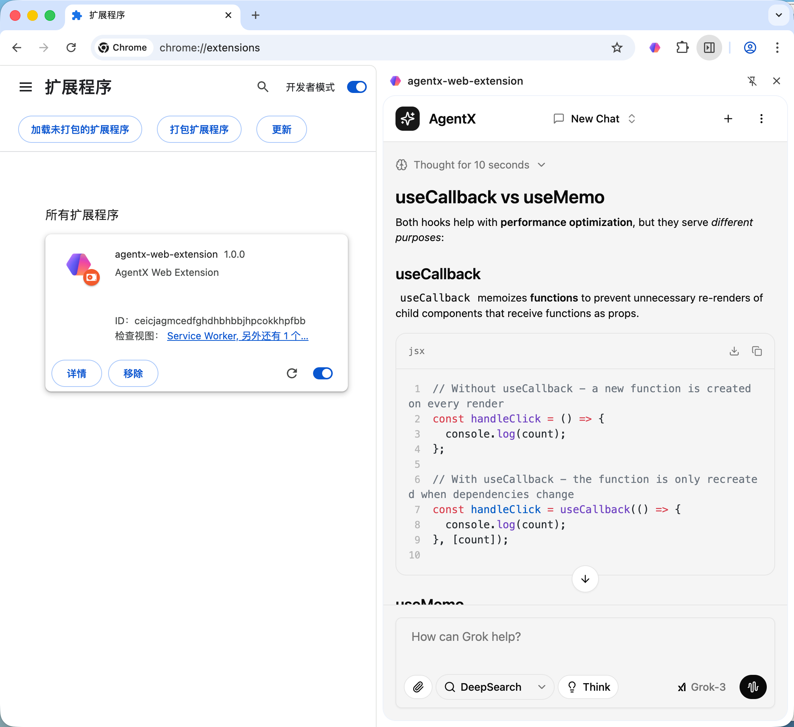

# AgentX Web Extension

AI chat assistant browser extension with MCP tool support, built with WXT + React + AI SDK.

## Features

- 🤖 **AI Chat** - Multi-model support (OpenAI, Anthropic, Google)
- 🔧 **MCP Tools** - Model Context Protocol integration with human-in-the-loop confirmation
- 💾 **Persistence** - Chat history stored in IndexedDB
- 🖥️ **Sidepanel UI** - Modern React interface in browser sidepanel
- 🌙 **Theme** - System/Light/Dark mode support
- 🌐 **Multi-browser** - Chrome, Firefox, Edge, Safari

## Screenshot



## Architecture

```
┌─────────────────────┐     ┌─────────────────────┐
│   Browser Extension │     │   Backend Server    │
│   (React + WXT)     │────►│   (Express + AI SDK)│
│                     │     │                     │
│  - Sidepanel UI     │     │  - /api/chat        │
│  - IndexedDB        │     │  - MCP Clients      │
│  - Settings Storage │     │  - HITL Processing  │
└─────────────────────┘     └─────────────────────┘
```

## Tech Stack

**Frontend**: WXT, React 19, TypeScript, Tailwind CSS 4, shadcn/ui, @ai-sdk/react

**Backend**: Express 5, AI SDK, @ai-sdk/google, @ai-sdk/mcp

## Getting Started

### Prerequisites

- Node.js 18+
- pnpm

### Installation

```bash
# Clone repository
git clone <repository-url>
cd agentx-web-extension

# Install extension dependencies
pnpm install

# Install backend dependencies
pnpm backend:install
```

### Development

```bash
# Terminal 1: Start backend server
pnpm backend:dev

# Terminal 2: Start extension dev mode
pnpm dev
```

### Load Extension

1. Open `chrome://extensions/`
2. Enable "Developer mode"
3. Click "Load unpacked extension"
4. Select `.output/chrome-mv3` folder

## Project Structure

```
├── entrypoints/              # WXT entry points
│   ├── background.ts         # Service worker
│   ├── content.ts            # Content script
│   └── sidepanel/            # React sidepanel UI
├── components/
│   ├── ui/                   # shadcn/ui components
│   └── ai-elements/          # AI chat UI elements
├── hooks/                    # React hooks
├── lib/                      # Utilities
├── backend/                  # Express backend
│   └── src/
│       ├── index.ts          # Server entry
│       ├── routes/chat.ts    # Chat API
│       └── mcp/client.ts     # MCP client
└── .memory/                  # AI context docs
```

## Commands

### Extension

```bash
pnpm dev              # Development (Chrome)
pnpm dev:firefox      # Development (Firefox)
pnpm build            # Production build
pnpm zip              # Create distribution
```

### Backend

```bash
pnpm backend:install  # Install dependencies
pnpm backend:dev      # Development server
pnpm backend:build    # Build TypeScript
pnpm backend:start    # Production server
```

## Configuration

### API Keys

Configure in Settings page:

- Google AI API Key
- AI Gateway API Key (for OpenAI/Anthropic)

### MCP Servers

Add MCP server configuration in Settings (Cursor/Claude Desktop compatible):

```json
{
  "mcpServers": {
    "filesystem": {
      "command": "npx",
      "args": ["-y", "@modelcontextprotocol/server-filesystem", "/path"]
    }
  }
}
```

### Environment Variables (Backend)

```bash
GOOGLE_GENERATIVE_AI_API_KEY=
AI_GATEWAY_API_KEY=
PORT=3001
```

## Adding shadcn/ui Components

```bash
pnpm dlx shadcn@latest add <component>
```

## Browser Support

- ✅ Chrome (Manifest V3)
- ✅ Firefox (Manifest V2)
- ✅ Edge (Manifest V3)
- ✅ Safari (Manifest V2)

## License

Apache-2.0 License - see [LICENSE](LICENSE) file.

---

Built with [WXT](https://wxt.dev), [AI SDK](https://sdk.vercel.ai), [Tailwind CSS](https://tailwindcss.com), and [shadcn/ui](https://ui.shadcn.com)
